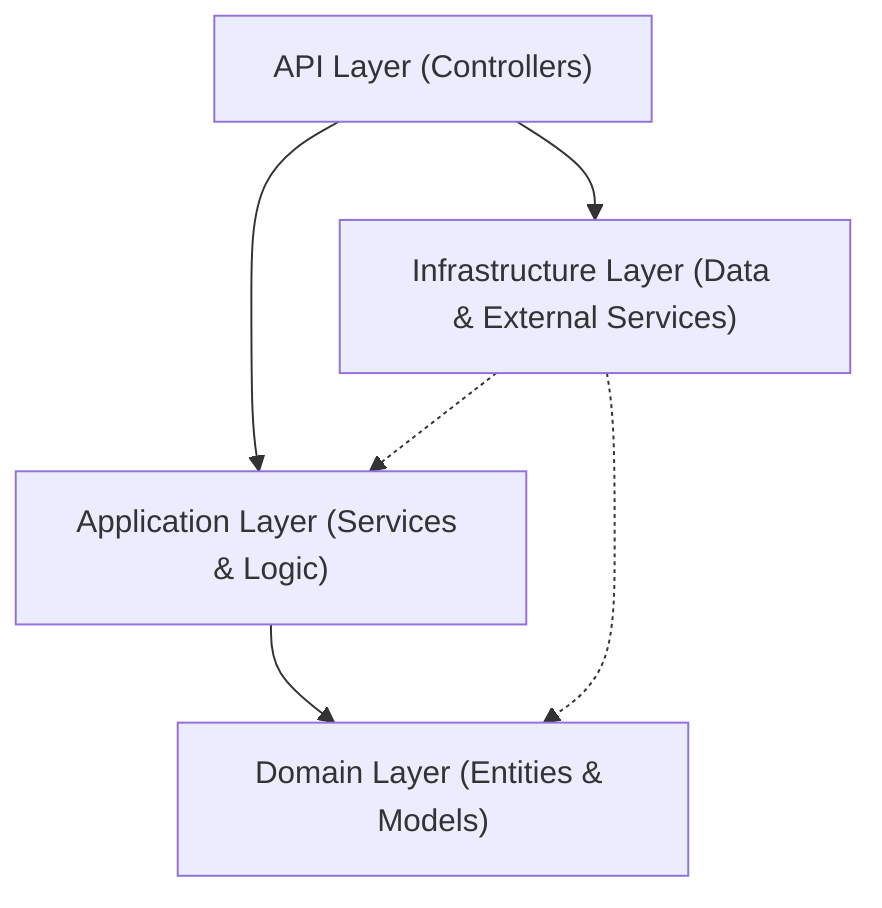

# Architecture Overview: Property Insurance System

This document provides a high-level overview of the architectural patterns used in the Property Insurance System.

---

## Backend: Clean Architecture (N-Layer)

The backend is built using **Clean Architecture** (also known as Onion Architecture or N-Layer Architecture), which prioritizes separation of concerns and dependency inversion.

### Layer Breakdown

1.  **API Layer** (`PropertyInsuranceSystem/API`):
    *   **Responsibility**: Entry point (HTTP Request handling), Middleware, Authentication (JWT), and Controllers.
    *   **Focus**: Routing and formatting responses.

2.  **Application Layer** (`PropertyInsuranceSystem/Application`):
    *   **Responsibility**: Core business logic, Interfaces, DTOs, and Orchestration.
    *   **Focus**: Defining *what* the system does (e.g., `PolicyRequestService`).

3.  **Domain Layer** (`PropertyInsuranceSystem/Domain`):
    *   **Responsibility**: Core entities, value objects, and business rules.
    *   **Focus**: The backbone of the business logic (e.g., `PolicyRequest` entity).

4.  **Infrastructure Layer** (`PropertyInsuranceSystem/Infrastructure`):
    *   **Responsibility**: Database persistence (EF Core), External APIs (Vertex AI), and Repository implementations.
    *   **Focus**: Technical details and data storage.

---

## Frontend: Feature-based Architecture

The frontend is built with **Angular** and follows a feature-oriented structure for scalability.

### Structure Breakdown

*   **Core** (`src/app/core`): Contains singleton services, global models, and interceptors (e.g., Auth Interceptor).
*   **Shared** (`src/app/shared`): Contains reusable components, pipes, and directives used across multiple features.
*   **Features** (`src/app/features`): Contains domain-specific features (e.g., Admin, Agent, Customer dashboards).
*   **Routing**: Centralized routing system (`app.routes.ts`) for navigation between features.

---

## System Flow (Example: Risk Calculation)

1.  **UI**: Customer submits property details via a feature component.
2.  **API**: `PolicyRequestController` receives the request.
3.  **Application**: `PolicyRequestService` processes the input, fetches the plan, and executes risk logic.
4.  **Domain**: Business rules (e.g., risk factors) are applied to the `PolicyRequest` entity.
5.  **Infrastructure**: `ApplicationDbContext` saves the updated request to the database.
6.  **UI**: User receives a notification via an Observable-based notification service.
